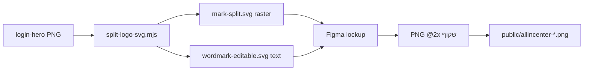

<<<<<<< HEAD
# מדריך מיתוג AllInCenter — וקטורים ל-Figma

> **חשוב:** לא השתמשנו ב-Figma ישירות. הוכנו **וקטורי SVG התחלתיים** + מדריך זה כדי שתוכלו לייבא, ללטש ולייצא ב-Figma (או כלי עיצוב אחר).

## קבצים בפרויקט

| קובץ | תיאור |
|------|--------|
| **`public/brand/allincenter-mark-split.svg`** | **סמל בלבד** (Hub + אוזניות) — חיתוך שמאל ~38% מ-PNG login; **רסטר מוטמע** (1:1 לצילום) |
| **`public/brand/allincenter-wordmark-editable.svg`** | **שם בלבד** — `<text>` + `<tspan>` לעריכת תווים ב-Figma (**A**, **I**, **C** מודגשים) |
| `public/brand/allincenter-mark.svg` | סמל וקטורי קווי (חלופה ל-Figma — לא מה-PNG) |
| `public/brand/allincenter-wordmark.svg` | וורדמרק וקטורי (זהה ל-editable; השתמשו ב-`-editable` לייבוא) |
| `public/brand/login-hero-full-v1.svg` | Lockup מלא כרסטר (גיבוי 1:1) |
| `docs/brand-preview.html` | תצוגה מקומית — lockup מ-mark-split + wordmark-editable |

PNG קיימים לריצה (`public/allincenter-logo*.png`) נשארים ללא שינוי — אין חיווט לכניסת דמו.

### פיצול מהלוגו (PNG)

```bash
node scripts/split-logo-svg.mjs
# מקור: public/brand-snapshots/login-hero-full-v1.png (או allincenter-logo.png)
# פלט: allincenter-mark-split.svg (חיתוך 584×1024 מ-1536×1024)
```

| חלק | סוג ב-Figma | עריכה |
|-----|-------------|--------|
| **mark-split** | תמונה / רסטר ב-SVG | מיקום וגודל; לווקטור אמיתי — `allincenter-mark.svg` |
| **wordmark-editable** | **Text** | עריכת אותיות, גופן Poppins Bold, גרדיאנטים על מילוי |

---

## 1. ייבוא SVG ל-Figma

### אפשרות א׳ — Place (מומלץ)

1. ב-Figma: **File → Place image…** (או `Ctrl+Shift+K` / `Cmd+Shift+K`).
2. בחרו **`allincenter-mark-split.svg`** ו-**`allincenter-wordmark-editable.svg`** (שני קבצים נפרדים).
3. לחצו על הקנבס — הוורדמרק אמור להישאר **Text**; הסמל מגיע כ**תמונה** (רסטר מוטמע).

### אבליה ב׳ — הדבקה

1. פתחו את קובץ ה-SVG בעורך טקסט.
2. העתיקו את כל תוכן ה-`<svg>…</svg>`.
3. ב-Figma: בחרו Frame → **Paste** — לעיתים נוצרות שכבות `Vector` / `Text`.

### אבליה ג׳ — ייבוא כקובץ

1. גררו את הקובץ מתוך `public/brand/` לחלון Figma.
2. ודאו ש-**Scale** נשמר (אל תמתחו לא-פרופורציונלית).

---

## 2. עריכה כשכבות נפרדות

### סמל (mark-split)

ייבוא `allincenter-mark-split.svg`:

1. שכבת **Image** אחת (חיתוך מה-PNG) — אין טקסט.
2. לעבודה וקטורית: השתמשו ב-`allincenter-mark.svg` במקום, או Trace ב-Figma (אופציונלי).

### סמל וקטורי (mark.svg — אופציונלי)

לאחר ייבוא `allincenter-mark.svg`:

1. **Un-group** (`Ctrl+Shift+G`) עד שה-hub, ה-spokes וה-headphones נפרדים.
2. שכבות מומלצות:
   - `hub-center` — עיגול מרכזי
   - `hub-spokes` — 6 קווים רדיאליים
   - `headset-band` — קשת עליונה
   - `headset-cups` — צדדים + בסיס
3. ב-Figma: **Outline stroke** רק אם צריך מילוי; לשמירה על מראה קווי — השאירו **Stroke** עם `Round cap / Join`.

### וורדמרק (wordmark-editable)

קובץ: **`allincenter-wordmark-editable.svg`** — אין hub, רק טקסט.

1. הטקסט אמור להישאר **Text** ב-Figma: לחצו כפול על **A** / **I** / **C** או על `ll`, `n`, `enter` (כל `<tspan>`).
2. גופן: **Poppins Bold** (מקושר ב-SVG ל-Google Fonts; בפרויקט: `scripts/fonts/Poppins-ExtraBold.ttf`).
3. אם Figma המיר ל-**Outline**: ערכו מסלולים; שימרו **A / I / C** גדולים יותר (~132% מהגוף).
   - ב-SVG ההתחלתי מודגשים **A, I, C**. ב-`BrandWordmark.jsx` (React) כרגע מודגשים **A ו-C** בלבד — ליישור מלא, עדכנו את הקומפוננטה אחרי אישור עיצוב ב-Figma.
4. גרדיאנטים:
   - **גוף:** `#8B5CF6` → `#2DD4BF`
   - **הדגשה (A,I,C):** `#22D3EE` → `#A78BFA` → `#E879F9`

### מצבי צבע ב-SVG (לפני Outline)

בשורש ה-`<svg>`:

| `data-theme` | שימוש |
|--------------|--------|
| `on-dark` | רקע סגול כהה (כניסה, `purple-950`) |
| `on-light` | `m3-page`, כרטיסים בהירים |
| `flat-on-dark` | (סמל בלבד) קווים לבנים `#F8FAFC` לייצוא PNG שטוח |

ב-Figma: שכפלו Frame לכל מצב; אחרי עיצוב אפשר למחוק את ה-`data-theme` מהקוד.

---

## 3. ייצוא @2x PNG שקוף לפיתוח

1. בחרו Frame בגודל סופי (לדוגמה סמל **96×96**, וורדמרק **520×72** — או הכפילו לפי צורך).
2. **Export** (פאנל ימין):
   - Format: **PNG**
   - Scale: **2x** (או 3x לרטינה)
   - סמן **Transparent background**
3. שמות מוצעים (תואם לקוד הקיים):

   | ייצוא | נתיב מוצע |
   |-------|-----------|
   | סמל כהה על רקע בהיר | `allincenter-icon-bright.png` |
   | סמל בהיר על רקע כהה | `allincenter-icon.png` |
   | Lockup מלא בהיר | `allincenter-logo-bright.png` |
   | Lockup כהה / login | `allincenter-logo.png` |

4. אחרי ייצוא: החליפו ב-`public/` **רק** אם מתאימים ל-QA; עדכנו `BRAND_*_SRC` ב-`BrandLogo.jsx` רק אם משנים שמות.

---

## 4. קישור לטוקני צבע באפליקציה

### React — `src/components/brand/BrandWordmark.jsx`

| קבוע / מחלקה | ערך |
|--------------|-----|
| `BRAND_ACCENT_COLOR` | `#22D3EE` |
| `BRAND_GRADIENT_DARK_CLASS` | `from-[#8B5CF6] to-[#2DD4BF]` |
| `BRAND_ACCENT_DARK_CLASS` | `from-[#22D3EE] via-[#A78BFA] to-[#E879F9]` |
| גוף (light) | `from-[#8B5CF6] to-[#2DD4BF]` |
| הדגשה (light) | `from-[#22D3EE] via-[#A78BFA] to-[#E879F9]` |

### CSS — `src/index.css` (`:root`)

| טוקן | HSL (Tailwind) | שימוש |
|------|----------------|--------|
| `--primary` | `262 52% 47%` | סגול ממשק |
| `--primary-container` | `262 100% 92%` | רקעים עדינים |
| `--chart-3` | `173 58% 39%` | טיל / ירוק-כחול |

### רקעי כניסה (דמו)

`AgentLogin.jsx`: `from-indigo-950 via-purple-950 to-slate-900` — Tailwind `purple-900` ≈ **`#4c1d95`**. הסמל `data-theme="on-dark"` מיועד לשטח זה.

### סקריפט ייצור PNG (התייחסות)

`scripts/create-bright-logo.mjs` — אותם RGB: violet `139,92,246`, teal `45,212,191`, cyan `34,211,238`.

---

## 5. Lockup ב-Figma (סמל + שם)

1. ייבאו **`allincenter-mark-split.svg`** + **`allincenter-wordmark-editable.svg`** לאותו Frame.
2. סמל משמאל (LTR), וורדמרק מימין — ריווח ~8–12% מגובה הסמל; יישור אנכי **Center**.
3. כוונו גובה סמל (~96px ב-preview) ורוחב וורדמרק (~420px) — ראו `docs/brand-preview.html`.
4. יחס מקורי lockup: **1536×1024** (38% שמאל = hub) — `BrandLogo.jsx` (`BRAND_HUB_SRC_WIDTH`).

---

## 6. תצוגה מקומית

פתחו בדפדפן:

`docs/brand-preview.html`

(נתיב יחסי ל-`../public/brand/…` — lockup: `mark-split` + `wordmark-editable`.)

---

## 7. חיווט באפליקציה (לא בוצע)

- כניסת נציג **ללא לוגו** (לפי בקשה).
- דף הבית / `BrandLogo` — עדיין PNG; להחליף ל-SVG רק כשתבקשו במפורש, למשל:

```jsx

```

---

## סיכום זרימה



שאלות על שחזור login: `docs/BRAND_SNAPSHOT_LOGIN_HERO.md`.
=======
# מדריך מיתוג AllInCenter — וקטורים ל-Figma

> **חשוב:** לא השתמשנו ב-Figma ישירות. הוכנו **וקטורי SVG התחלתיים** + מדריך זה כדי שתוכלו לייבא, ללטש ולייצא ב-Figma (או כלי עיצוב אחר).

## קבצים בפרויקט

| קובץ | תיאור |
|------|--------|
| **`public/brand/allincenter-mark-split.svg`** | **סמל בלבד** (Hub + אוזניות) — חיתוך שמאל ~38% מ-PNG login; **רסטר מוטמע** (1:1 לצילום) |
| **`public/brand/allincenter-wordmark-editable.svg`** | **שם בלבד** — `<text>` + `<tspan>` לעריכת תווים ב-Figma (**A**, **I**, **C** מודגשים) |
| `public/brand/allincenter-mark.svg` | סמל וקטורי קווי (חלופה ל-Figma — לא מה-PNG) |
| `public/brand/allincenter-wordmark.svg` | וורדמרק וקטורי (זהה ל-editable; השתמשו ב-`-editable` לייבוא) |
| `public/brand/login-hero-full-v1.svg` | Lockup מלא כרסטר (גיבוי 1:1) |
| `docs/brand-preview.html` | תצוגה מקומית — lockup מ-mark-split + wordmark-editable |

PNG קיימים לריצה (`public/allincenter-logo*.png`) נשארים ללא שינוי — אין חיווט לכניסת דמו.

### פיצול מהלוגו (PNG)

```bash
node scripts/split-logo-svg.mjs
# מקור: public/brand-snapshots/login-hero-full-v1.png (או allincenter-logo.png)
# פלט: allincenter-mark-split.svg (חיתוך 584×1024 מ-1536×1024)
```

| חלק | סוג ב-Figma | עריכה |
|-----|-------------|--------|
| **mark-split** | תמונה / רסטר ב-SVG | מיקום וגודל; לווקטור אמיתי — `allincenter-mark.svg` |
| **wordmark-editable** | **Text** | עריכת אותיות, גופן Poppins Bold, גרדיאנטים על מילוי |

---

## 1. ייבוא SVG ל-Figma

### אפשרות א׳ — Place (מומלץ)

1. ב-Figma: **File → Place image…** (או `Ctrl+Shift+K` / `Cmd+Shift+K`).
2. בחרו **`allincenter-mark-split.svg`** ו-**`allincenter-wordmark-editable.svg`** (שני קבצים נפרדים).
3. לחצו על הקנבס — הוורדמרק אמור להישאר **Text**; הסמל מגיע כ**תמונה** (רסטר מוטמע).

### אבליה ב׳ — הדבקה

1. פתחו את קובץ ה-SVG בעורך טקסט.
2. העתיקו את כל תוכן ה-`<svg>…</svg>`.
3. ב-Figma: בחרו Frame → **Paste** — לעיתים נוצרות שכבות `Vector` / `Text`.

### אבליה ג׳ — ייבוא כקובץ

1. גררו את הקובץ מתוך `public/brand/` לחלון Figma.
2. ודאו ש-**Scale** נשמר (אל תמתחו לא-פרופורציונלית).

---

## 2. עריכה כשכבות נפרדות

### סמל (mark-split)

ייבוא `allincenter-mark-split.svg`:

1. שכבת **Image** אחת (חיתוך מה-PNG) — אין טקסט.
2. לעבודה וקטורית: השתמשו ב-`allincenter-mark.svg` במקום, או Trace ב-Figma (אופציונלי).

### סמל וקטורי (mark.svg — אופציונלי)

לאחר ייבוא `allincenter-mark.svg`:

1. **Un-group** (`Ctrl+Shift+G`) עד שה-hub, ה-spokes וה-headphones נפרדים.
2. שכבות מומלצות:
   - `hub-center` — עיגול מרכזי
   - `hub-spokes` — 6 קווים רדיאליים
   - `headset-band` — קשת עליונה
   - `headset-cups` — צדדים + בסיס
3. ב-Figma: **Outline stroke** רק אם צריך מילוי; לשמירה על מראה קווי — השאירו **Stroke** עם `Round cap / Join`.

### וורדמרק (wordmark-editable)

קובץ: **`allincenter-wordmark-editable.svg`** — אין hub, רק טקסט.

1. הטקסט אמור להישאר **Text** ב-Figma: לחצו כפול על **A** / **I** / **C** או על `ll`, `n`, `enter` (כל `<tspan>`).
2. גופן: **Poppins Bold** (מקושר ב-SVG ל-Google Fonts; בפרויקט: `scripts/fonts/Poppins-ExtraBold.ttf`).
3. אם Figma המיר ל-**Outline**: ערכו מסלולים; שימרו **A / I / C** גדולים יותר (~132% מהגוף).
   - ב-SVG ההתחלתי מודגשים **A, I, C**. ב-`BrandWordmark.jsx` (React) כרגע מודגשים **A ו-C** בלבד — ליישור מלא, עדכנו את הקומפוננטה אחרי אישור עיצוב ב-Figma.
4. גרדיאנטים:
   - **גוף:** `#8B5CF6` → `#2DD4BF`
   - **הדגשה (A,I,C):** `#22D3EE` → `#A78BFA` → `#E879F9`

### מצבי צבע ב-SVG (לפני Outline)

בשורש ה-`<svg>`:

| `data-theme` | שימוש |
|--------------|--------|
| `on-dark` | רקע סגול כהה (כניסה, `purple-950`) |
| `on-light` | `m3-page`, כרטיסים בהירים |
| `flat-on-dark` | (סמל בלבד) קווים לבנים `#F8FAFC` לייצוא PNG שטוח |

ב-Figma: שכפלו Frame לכל מצב; אחרי עיצוב אפשר למחוק את ה-`data-theme` מהקוד.

---

## 3. ייצוא @2x PNG שקוף לפיתוח

1. בחרו Frame בגודל סופי (לדוגמה סמל **96×96**, וורדמרק **520×72** — או הכפילו לפי צורך).
2. **Export** (פאנל ימין):
   - Format: **PNG**
   - Scale: **2x** (או 3x לרטינה)
   - סמן **Transparent background**
3. שמות מוצעים (תואם לקוד הקיים):

   | ייצוא | נתיב מוצע |
   |-------|-----------|
   | סמל כהה על רקע בהיר | `allincenter-icon-bright.png` |
   | סמל בהיר על רקע כהה | `allincenter-icon.png` |
   | Lockup מלא בהיר | `allincenter-logo-bright.png` |
   | Lockup כהה / login | `allincenter-logo.png` |

4. אחרי ייצוא: החליפו ב-`public/` **רק** אם מתאימים ל-QA; עדכנו `BRAND_*_SRC` ב-`BrandLogo.jsx` רק אם משנים שמות.

---

## 4. קישור לטוקני צבע באפליקציה

### React — `src/components/brand/BrandWordmark.jsx`

| קבוע / מחלקה | ערך |
|--------------|-----|
| `BRAND_ACCENT_COLOR` | `#22D3EE` |
| `BRAND_GRADIENT_DARK_CLASS` | `from-[#8B5CF6] to-[#2DD4BF]` |
| `BRAND_ACCENT_DARK_CLASS` | `from-[#22D3EE] via-[#A78BFA] to-[#E879F9]` |
| גוף (light) | `from-[#8B5CF6] to-[#2DD4BF]` |
| הדגשה (light) | `from-[#22D3EE] via-[#A78BFA] to-[#E879F9]` |

### CSS — `src/index.css` (`:root`)

| טוקן | HSL (Tailwind) | שימוש |
|------|----------------|--------|
| `--primary` | `262 52% 47%` | סגול ממשק |
| `--primary-container` | `262 100% 92%` | רקעים עדינים |
| `--chart-3` | `173 58% 39%` | טיל / ירוק-כחול |

### רקעי כניסה (דמו)

`AgentLogin.jsx`: `from-indigo-950 via-purple-950 to-slate-900` — Tailwind `purple-900` ≈ **`#4c1d95`**. הסמל `data-theme="on-dark"` מיועד לשטח זה.

### סקריפט ייצור PNG (התייחסות)

`scripts/create-bright-logo.mjs` — אותם RGB: violet `139,92,246`, teal `45,212,191`, cyan `34,211,238`.

---

## 5. Lockup ב-Figma (סמל + שם)

1. ייבאו **`allincenter-mark-split.svg`** + **`allincenter-wordmark-editable.svg`** לאותו Frame.
2. סמל משמאל (LTR), וורדמרק מימין — ריווח ~8–12% מגובה הסמל; יישור אנכי **Center**.
3. כוונו גובה סמל (~96px ב-preview) ורוחב וורדמרק (~420px) — ראו `docs/brand-preview.html`.
4. יחס מקורי lockup: **1536×1024** (38% שמאל = hub) — `BrandLogo.jsx` (`BRAND_HUB_SRC_WIDTH`).

---

## 6. תצוגה מקומית

פתחו בדפדפן:

`docs/brand-preview.html`

(נתיב יחסי ל-`../public/brand/…` — lockup: `mark-split` + `wordmark-editable`.)

---

## 7. חיווט באפליקציה (לא בוצע)

- כניסת נציג **ללא לוגו** (לפי בקשה).
- דף הבית / `BrandLogo` — עדיין PNG; להחליף ל-SVG רק כשתבקשו במפורש, למשל:

```jsx

```

---

## סיכום זרימה


שאלות על שחזור login: `docs/BRAND_SNAPSHOT_LOGIN_HERO.md`.
>>>>>>> 842dd9e (Initial commit)
