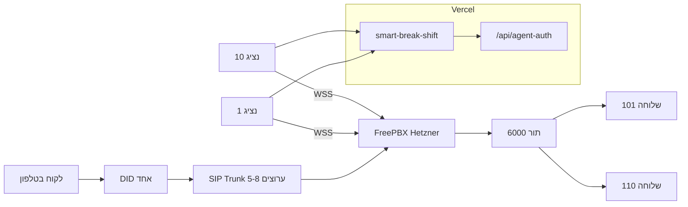

# מרכזייה עצמאית (FreePBX על Hetzner) — מדריך שלב-אחר-שלב

מדריך מלא להקמת **מרכזייה עצמית** לחיבור **smart-break-shift** — Softphone בדפדפן, תור, ועד **10 נציגים במקביל**.

לסקירת Softphone, CRM, משתני סביבה ומעבר מדמו — ראו [TELEPHONY_SETUP.md](./TELEPHONY_SETUP.md).

---

## תקציר מנהלים

| פרמטר | ערך |
|--------|-----|
| **תרחיש** | מוקד שירות עם **מספר DID אחד** (קו ראשי) → **תור** → עד **10 נציגים** בדפדפן (WebRTC) |
| **Trunk** | **5–8 ערוצים** במקביל (שיחות PSTN חיצוניות) |
| **שלוחות** | 101–110 (PJSIP + WSS) |
| **תור** | `support-queue` (מספר פנימי 6000) |
| **תשתית** | VPS ב-Hetzner (FreePBX) + אפליקציה ב-Vercel |
| **זמן הקמה** | 3 שבועות (Lab → חיבור Trunk → Go-Live) |
| **עלות חודשית משוערת (פרודקשן)** | **~₪150–280/חודש** — פירוט מלא ב-[עלויות](#עלויות--סיכום-ותרחישים) |

**מה מקבלים בסוף:** לקוח מתקשר למספר הראשי → נכנס לתור → נציג פנוי בדפדפן עונה; screen pop ב-CRM; שיחות יוצאות מהווידג'ט.



---

## עלויות — סיכום ותרחישים

> מחירים **משוערים** (יוני 2026), לפני מע"מ. שער חליפין לדוגמה: **€1 ≈ ₪4**. Trunk — לפי ספק VoIP ישראלי (019, Bezeq International, HOT Mobile Business, Voicenter SIP וכו׳). VPS — לפי [hetzner.com/cloud](https://www.hetzner.com/cloud).

### עלויות חד-פעמיות (הקמה)

| פריט | טווח מחיר | הערות |
|------|-----------|--------|
| הקמת VPS ב-Hetzner | **חינם** | אין דמי הקמה; חיוב רק מהחודש הראשון של השרת |
| דומיין (`pbx.yourdomain.com`) | **₪40–80/שנה** | ~₪3–7 לחודש; רוב הרשמות כוללות DNS |
| Trunk — דמי חיבור (לפי ספק) | **₪0–300** | לעיתים 0; משולם בשבוע 2–3 |
| יועץ / מפתח SIP (אופציונלי) | **₪0–3,000** | Lab עצמאי = ₪0; ליווי Trunk + Go-live = ₪1,500–3,000 |

**סה״כ חד-פעמי טיפוסי:** **₪40–80** (דומיין בלבד) עד **₪3,300+** (דומיין + Trunk + יועץ).

### עלויות חודשיות קבועות (OPEX)

| פריט | €/חודש | ₪/חודש | הערות |
|------|--------|--------|--------|
| VPS **CX22** (2 vCPU, 4 GB) | **€4.5** | ~₪18 | מספיק ל-Lab ועד ~5 נציגים |
| VPS **CPX21** (3 vCPU, 4 GB) | **€8** | ~₪32 | מומלץ לפרודקשן 10 נציגים + עומס |
| **DID** — מספר נכנס ישראלי | — | **₪15–30** | קו ראשי אחד |
| **Trunk** — דמי בסיס | — | **₪30–80** | כולל מספר ערוצים (למשל 3–8) |
| דקות שיחה (נכנסות + יוצאות) | — | **₪0.03–0.08/דקה** | תלוי נפח וספק; לעיתים חבילות |
| coturn (על אותו VPS) | €0 | ₪0 | תוכנה חינמית |
| Vercel (אפליקציה) | €0 | ₪0 | תוכנית חינמית / קיימת |

> **שלב Lab (שבוע 1):** רק VPS — **אין Trunk, אין DID, אין דקות**.

### תרחישי עלות חודשית (סה״כ)

| תרחיש | הרכב | סה״כ משוער/חודש |
|--------|------|------------------|
| **Lab בלבד** (ללא Trunk) | CX22; שלוחות WebRTC פנימיות בלבד | **~₪20–40** |
| **פיילוט** — 3 נציגים + Trunk 3 ערוצים, ~300 דק׳ | CX22 + DID + בסיס Trunk + דקות | **~₪80–120** |
| **פרודקשן** — 10 נציגים + 8 ערוצים, ~2,000 דק׳ | CPX21 + DID + בסיס Trunk + דקות | **~₪150–280** |

#### פירוט לדוגמה — פיילוט (3 נציגים, 300 דק׳)

| פריט | חישוב | סכום |
|------|--------|------|
| VPS CX22 | €4.5 × 4 | ~₪18 |
| DID | קבוע | ~₪22 |
| Trunk בסיס (3 ערוצים) | קבוע | ~₪50 |
| 300 דק׳ × ₪0.05 | משתנה | ~₪15 |
| **סה״כ** | | **~₪105** |

#### פירוט לדוגמה — פרודקשן (10 נציגים, 2,000 דק׳)

| פריט | חישוב | סכום |
|------|--------|------|
| VPS CPX21 | €8 × 4 | ~₪32 |
| DID | קבוע | ~₪22 |
| Trunk בסיס (8 ערוצים) | קבוע | ~₪65 |
| 2,000 דק׳ × ₪0.05 | משתנה | ~₪100 |
| **סה״כ** | | **~₪219** |

### עלות לפי שלב (שבוע 1 → Go-live)

| שלב | משך | מה רץ | עלות משוערת |
|------|------|--------|-------------|
| **שבוע 1 — Lab** | 7 ימים | VPS בלבד; שלוחות WebRTC; ללא PSTN | **~₪20–40** (חודש VPS בלבד) |
| **שבוע 2 — Trunk** | 7 ימים | + הזמנת Trunk/DID; בדיקות ניתוב; coturn | **~₪50–90** (VPS + דמי בסיס Trunk/DID; מעט דקות) |
| **שבוע 3 — Go-live** | 7 ימים | שיחות אמיתיות; ניטור; CRM | **~₪80–280** (לפי תרחיש פיילוט/פרודקשן) |

### השוואה ל-Voicenter SaaS — חיסכון משוער

| מודל | 10 נציגים + Trunk | הערה |
|------|-------------------|------|
| **Voicenter SaaS** (מוקד מנוהל) | **~₪800–2,000+/חודש** | רישוי לנציג, תור, דוחות, לעיתים דקות |
| **FreePBX עצמאי** (תרחיש פרודקשן) | **~₪150–280/חודש** | VPS + Trunk + דקות בלבד |
| **חיסכון משוער** | **~₪500–1,700/חודש** | תלוי נפח דקות ורישוי SaaS קיים |

> **שימו לב:** בעלות עצמאית מוסיפים זמן IT (עדכונים, גיבויים, תקלות). החיסכון מוצדק כשיש מישהו שמטפל ב-PBX או כשהנפח גדול מספיק. ב-Lab אין חיסכון מול SaaS — רק הוכחת טכנולוגיה בעלות נמוכה (**~₪20–40/חודש**).

### השוואת VPS — CX22 מול CPX21

| | **CX22** | **CPX21** |
|---|----------|-----------|
| vCPU | 2 (shared) | 3 (shared) |
| RAM | 4 GB | 4 GB |
| מחיר | **€4.5/חודש** (~₪18) | **€8/חודש** (~₪32) |
| מתאים ל | Lab, פיילוט, עד ~5 נציגים פעילים | פרודקשן 10 נציגים, הקלטות, AMI |

> **המלצה:** התחילו ב-**CX22**; שדרגו ל-**CPX21** רק אם יש בעיות CPU או הקלטות.

---

## שלבים לפי שבועות (Week 1–3)

### שבוע 1 — Lab: VPS, FreePBX, שלוחות, WSS

**מטרה:** נציגים נרשמים בדפדפן ל-FreePBX — **בלי Trunk**, בלי שיחות PSTN.

#### יום 1–2: תשתית

- [ ] פתיחת פרויקט ב-[Hetzner Cloud Console](https://console.hetzner.cloud/) (שם: `hyp-pbx`)
- [ ] הזמנת VPS: **Ubuntu 22.04**, **CX22**, Falkenstein / Helsinki, IPv4, SSH key
- [ ] רישום IP ציבורי; הגדרת Firewall (22, 80, 443, 8089, UDP 10000–20000)
- [ ] רכישת/שיוך דומיין — רשומת **A**: `pbx.yourdomain.com` → IP

| פעולה | עלות |
|--------|------|
| VPS CX22 | €4.5/חודש (~₪18) |
| דומיין (אם חדש) | ≈₪50–80/שנה |

#### יום 3–4: FreePBX

- [ ] התקנת FreePBX (ISO Sangoma מומלץ, או Ubuntu + מדריך [Sangoma](https://sangomakb.atlassian.net/wiki/spaces/FP/pages/9732093/Installing+FreePBX))
- [ ] כניסה ראשונה: `https://pbx.yourdomain.com` — סיסמת admin חזקה (vault)
- [ ] **Module Admin:** `certman`, `queues`, `userman`, `sysinfo`
- [ ] **Certificate Management** → Let's Encrypt → Auto Renew

#### יום 5: WebRTC / WSS

- [ ] **Settings → Asterisk SIP Settings → WebRTC:** Enable = Yes
- [ ] STUN: `stun:stun.l.google.com:19302`
- [ ] וידוא WSS: `wss://pbx.yourdomain.com:8089/ws` (או `/ws` על 443 דרך reverse proxy)
- [ ] בדיקה: `asterisk -rx "http show status"`

#### יום 6–7: שלוחות 101–110

- [ ] **Applications → Extensions → Add → PJSIP** — שלוחות 101–110
- [ ] לכל שלוחה: Secret ייחודי, **Enable WebRTC = Yes**, Transport = WSS
- [ ] טבלת מיפוי (לא ב-git):

| נציג (שם באפליקציה) | שלוחה | סיסמה |
|---------------------|--------|--------|
| רחלה מנשה | 101 | *** |
| … | 102–110 | *** |

**תוצר שבוע 1:** FreePBX פעיל, TLS, 10 שלוחות WebRTC, WSS נגיש.

---

### שבוע 2 — תור, Vercel, coturn, הזמנת Trunk

**מטרה:** תור פעיל, אפליקציה מתחברת ל-PBX, הזמנת קו חיצוני.

#### יום 1–2: הגדרת תור (ראו [סעיף 6](#6-הגדרת-תור-ב-freepbx))

- [ ] יצירת תור `6000` / `support-queue`
- [ ] חיבור שלוחות 101–110 כחברי תור
- [ ] בדיקת תור פנימית (2 דפדפנים, 2 נציגים)

#### יום 3–4: חיבור Vercel (ראו [סעיף 7](#7-חיבור-vercel))

- [ ] הגדרת `VITE_SIP_WS_URL` + משתני שרת SIP ב-Vercel
- [ ] `SIP_AGENT_MAP` + `SIP_USER_101`…`SIP_PASSWORD_110`
- [ ] הסרת `VITE_DEMO_MODE=true` מפרויקט הפרודקשן
- [ ] Redeploy + בדיקת `POST /api/agent-auth` עם `sip_token_mint`

#### יום 5: coturn (אופציונלי — נציגים מאחורי VPN)

- [ ] התקנת coturn על **אותו VPS** (חינם):

```bash
apt install coturn -y
# /etc/turnserver.conf — listening-port=3478, realm=pbx.yourdomain.com
# user=turnuser:turnpass
systemctl enable coturn && systemctl start coturn
```

- [ ] פתיחת UDP/TCP **3478** (+ 49152–65535 relay) ב-Firewall
- [ ] `VITE_ICE_SERVERS` ב-Vercel עם TURN (ראו `.env.example`)

| פעולה | עלות |
|--------|------|
| coturn | **€0 / ₪0** (על VPS קיים) |

#### יום 6–7: הזמנת Trunk

- [ ] שליחת מייל לספק VoIP — [תבנית בסעיף 5](#5-מה-להזמין-מספק-trunk--תבנית-מייל)
- [ ] מעקב אחר זמן אספקה (בדרך כלל 3–10 ימי עסקים)

**תוצר שבוע 2:** תור + חיבור אפליקציה; Trunk בהזמנה.

---

### שבוע 3 — Trunk, DID, Go-Live

**מטרה:** שיחות אמיתיות מ-PSTN, בדיקות מלאות, עלייה לייב.

#### יום 1–2: חיבור Trunk

- [ ] **Connectivity → Trunks → Add SIP (PJSIP)** — פרטי ספק
- [ ] **Connectivity → Inbound Routes** — DID → `support-queue` (6000)
- [ ] **Outbound Routes** — חיוג יוצא דרך Trunk (קידומת 0 / 972)
- [ ] בדיקת רישום Trunk: `pjsip show registrations`

| פעולה | עלות חד-פעמית | עלות חודשית |
|--------|---------------|-------------|
| Trunk setup | ₪0–300 | — |
| DID ×1 | — | ₪25–45 |
| 5–8 ערוצים | — | ₪150–350 |

#### יום 3–4: אינטגרציה ו-CRM

- [ ] שיחה נכנסת → screen pop + חיפוש CRM
- [ ] disposition בסיום שיחה
- [ ] (אופציונלי) CDR / webhook ל-Supabase

#### יום 5–7: Go-Live (ראו [סעיף 8](#8-בדיקות-go-live))

- [ ] צ'קליסט Lab + Trunk — כל הסעיפים ירוקים
- [ ] 3 נציגים בפיילוט → הרחבה ל-10
- [ ] ניטור תור: `queue show support-queue`

**תוצר שבוע 3:** מוקד חי עם DID, תור, 10 נציגים.

---

## 5. מה להזמין מספק Trunk — תבנית מייל

העתיקו, מלאו `[...]` ושלחו לספק VoIP:

```
נושא: בקשה לחיבור SIP Trunk + DID — מוקד שירות (FreePBX)

שלום,

אנו מקימים מוקד שירות עם מרכזייה עצמית (FreePBX) ומבקשים הצעת מחיר וחיבור:

דרישות:
• SIP Trunk עם 5–8 ערוצים (channels) במקביל
• מספר DID אחד (קו ראשי ישראלי) — ניתוב לתור פנימי
• תמיכה ב-G.711 (ulaw/alaw)
• חיוג יוצא לישראל (קידומות 0X / 972)
• מספר מזהה (CLI) — הצגת מספר ה-DID בחיוג יוצא

פרטים טכניים:
• PBX: FreePBX 16/17 (Asterisk PJSIP)
• מיקום שרת: Hetzner — EU (גרמניה/פינלנד)
• IP ציבורי של השרת: [HETZNER_IP]
• רישום SIP: לפי IP / Digest (לפי מה שנתמך)
• פורט SIP: 5060 UDP/TCP
• TLS/SRTP: נא לציין אם זמין ועלות

נציגים:
• עד 10 נציגים — Softphone בדפדפן (WebRTC/WSS)
• אין צורך ב-DID נפרד לכל נציג

בקשות נוספות:
• עלות חודשית (DID + ערוצים)
• עלות דקה נכנסת / יוצאת
• עלות הקמה חד-פעמית
• זמן אספקה משוער
• האם יש CDR / Webhook / API לדוחות שיחות?

תודה,
[שם]
[טלפון]
[ח.פ / עוסק]
```

**אחרי קבלת פרטים:** Trunk ב-FreePBX → Inbound Route (DID → תור 6000) → Outbound Route.

---

## 6. הגדרת תור ב-FreePBX

### 6.1 יצירת התור

1. **Applications → Queues → Add Queue**

| שדה | ערך | הסבר |
|-----|-----|------|
| Queue Number | `6000` | מספר פנימי |
| Queue Name | `support-queue` | שם לוגי |
| Queue Password | (ריק) | — |
| Alert Info | (ריק) | — |
| Static Agents | (לא) | — |
| Ring Strategy | `rrmemory` | Round-robin — חלוקה שוויונית |
| Agent Timeout | `15` | שניות לצלצול לנציג |
| Retry | `5` | שניות בין ניסיונות |
| Max Wait Time | `300` | 5 דקות המתנה מקסימלית |
| Max Callers | `20` | תור מלא |
| Join Empty | **No** | לא להכניס אם אין נציגים |
| Leave When Empty | **Yes** | — |
| Report Hold Time | **Yes** | — |
| Music on Hold | `default` | — |
| Announce Position | **Yes** | «אתה מספר X בתור» |
| Announce Hold Time | **Yes** | — |

2. **Submit and Apply Config**

### 6.2 חיבור נציגים לתור

**אופציה א' — Static (מומלץ ל-Lab / פיילוט):**

1. בעריכת התור → **Queue Members**
2. הוסיפו: `101`, `102`, … `110` — Priority 0, Penalty 0

**אופציה ב' — Dynamic (נציגים נרשמים בעצמם):**

1. Feature Code `*45` — login/logout מתור
2. או: Agent login דרך UCP / AMI

### 6.3 ניתוב נכנס (אחרי Trunk)

1. **Connectivity → Inbound Routes → Add**
2. **DID Number:** מספר מהספק (למשל `972XXXXXXXXX`)
3. **Set Destination:** `Queues` → `support-queue`
4. **Submit and Apply Config**

### 6.4 בדיקת תור (Lab — בלי Trunk)

- [ ] 2 נציגים רשומים ב-WSS (101, 102)
- [ ] מ-FreePBX CLI: `queue show support-queue` — רואים members
- [ ] חיוג פנימי ל-6000 מ-softphone / שלוחת בדיקה
- [ ] וידוא שהשיחה מגיעה לנציג הבא בתור

---

## 7. חיבור Vercel

### 7.1 משתני צד-לקוח (Vite — נכנסים ל-build)

ב-Vercel → **Project → Settings → Environment Variables → Production:**

```env
VITE_SIP_WS_URL=wss://pbx.yourdomain.com:8089/ws
```

אופציונלי — TURN (נציגים מאחורי VPN):

```env
VITE_ICE_SERVERS=[{"urls":"stun:stun.l.google.com:19302"},{"urls":"turn:pbx.yourdomain.com:3478","username":"turnuser","credential":"turnpass"}]
```

> **אל** תגדירו `VITE_SIP_PASSWORD` בפרודקשן.

### 7.2 משתני שרת (Vercel — ל-SIP דרך `/api/agent-auth`)

**נציג יחיד (בדיקה ראשונה):**

```env
SIP_WS_URL=wss://pbx.yourdomain.com:8089/ws
SIP_DOMAIN=pbx.yourdomain.com
SIP_USER=101
SIP_PASSWORD=סיסמת-שלוחה-101
```

**10 נציגים (מומלץ):**

```env
SIP_WS_URL=wss://pbx.yourdomain.com:8089/ws
SIP_DOMAIN=pbx.yourdomain.com
SIP_AGENT_MAP={"רחלה מנשה":"101","שרון שפיר":"102","נציג 01":"101","נציג 02":"102"}
SIP_USER_101=101
SIP_PASSWORD_101=***
SIP_USER_102=102
SIP_PASSWORD_102=***
# … עד SIP_USER_110 / SIP_PASSWORD_110
```

האפליקציה קוראת: `POST /api/agent-auth` — `sip_token_mint` / `sip_token_redeem` (Bearer JWT).

### 7.3 מעבר מדמו

1. פרויקט **פרודקשן** ב-Vercel: **אין** `VITE_DEMO_MODE=true`
2. הגדרת כל משתני SIP למעלה
3. **Deployments → Redeploy** (חובה אחרי כל שינוי `VITE_*`)

### 7.4 בדיקה מקומית

```powershell
npm install
# .env.local — אותם משתנים
npx vercel dev
# בדפדפן: וידג'ט טלפוניה → «התחבר»
```

---

## 8. בדיקות Go-Live

### 8.1 Lab (בלי Trunk)

- [ ] FreePBX נגיש ב-`https://pbx.yourdomain.com` — תעודה תקפה
- [ ] `wss://...` — אין שגיאת TLS בדפדפן (Chrome)
- [ ] נציג 1: «התחבר» → סטטוס **רשום** (Registered)
- [ ] נציג 2 (שלוחה 102): אותו דבר
- [ ] `sip_token_mint` + `sip_token_redeem` מחזירים שלוחה נכונה (JWT + same-origin)
- [ ] אין סיסמאות SIP ב-build (`dist/assets/*.js`)
- [ ] מיקרופון + `<audio>` — שומעים צד שני
- [ ] תור: חיוג ל-6000 מגיע לנציג בתור

### 8.2 פרודקשן (אחרי Trunk + DID)

- [ ] שיחה נכנסת מנייד אמיתי → תור → נציג בדפדפן עונה
- [ ] screen pop + חיפוש CRM לפי מספר מתקשר
- [ ] שיחה יוצאת מהווידג'ט לנייד — CLI מוצג נכון
- [ ] עד **10 שיחות במקביל** (עומס) — אין drop
- [ ] disposition נשמר ב-CRM
- [ ] נציג מאחורי VPN — שמע דו-כיווני (אם הוגדר TURN)
- [ ] `queue show support-queue` — callers / members תקינים

### 8.3 פתרון תקלות

| תסמין | פתרון |
|--------|--------|
| `WebRTC דורש HTTPS` | פרסום ב-Vercel; localhost לפיתוח בלבד |
| `403` ב-SIP | JWT חסר / same-origin / הרשאת נציג |
| `503 SIP לא מוגדר` | חסרים משתני שרת — Redeploy |
| רשום אבל אין שמע | UDP 10000–20000; ICE/TURN |
| נציג מקבל שלוחה של אחר | בדקו `SIP_AGENT_MAP` + שם ב-localStorage |
| WSS נכשל | תעודה, firewall 8089/443, נתיב `/ws` |
| Trunk לא נרשם | IP whitelist אצל ספק; `pjsip show registrations` |

---

## 9. חיבור האפליקציה (קוד קיים)

| רכיב | תפקיד |
|------|--------|
| `telephonyProvider.js` | sip.js — WSS, ICE, הרשמה, שיחות |
| `api/agent-auth.js` | SIP + Auth (כולל `sip_token_mint` / `sip_token_redeem`) |
| `SoftphoneWidget.jsx` | UI — חיוג, מענה, disposition |
| `telephonyStore.js` | דמו: סימולציית תור; לייב: SIP אמיתי |

---

## 10. צ'קליסט «מה לעשות היום»

| # | פעולה | אחראי | עלות |
|---|--------|--------|------|
| 1 | הזמנת VPS Hetzner (CX22) | IT | €4.5/חודש (~₪18) |
| 2 | DNS `pbx.yourdomain.com` → IP | IT | ≈₪0 |
| 3 | התקנת FreePBX + Let's Encrypt | IT | — |
| 4 | שלוחות 101–110 + WebRTC | IT | — |
| 5 | תור 6000 + חברי תור | IT | — |
| 6 | משתני SIP ב-Vercel + Redeploy | מפתח | — |
| 7 | בדיקה: 2 נציגים ב-WSS | IT | — |
| 8 | שליחת הזמנת Trunk (סעיף 5) | IT | ₪0–300 setup |
| 9 | coturn (אם VPN) | IT | €0 |
| 10 | Go-Live + פיילוט 3 → 10 | כולם | Trunk חודשי |

---

## 11. מה אחרי Go-Live (שלבים עתידיים)

1. **CDR / webhooks** — סנכרון אוטומטי ל-`crm_call_logs` ב-Supabase
2. **הקלטות** — FreePBX → S3 / אחסון
3. **ניטור תור אמיתי** — AMI/REST לדשבורד המוקד
4. **IVR** — תפריט קולי לפני התור

---

## קישורים

| מסמך | תוכן |
|------|------|
| [TELEPHONY_SETUP.md](./TELEPHONY_SETUP.md) | Softphone, CRM, Twilio, משתני env |
| [DEMO_VS_PRODUCTION.md](./DEMO_VS_PRODUCTION.md) | הפרדת דמו / פרודקשן ב-Vercel |
| `.env.example` | דוגמאות SIP, ICE, `SIP_AGENT_MAP` |
