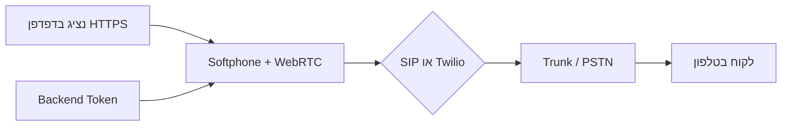

# הגדרת טלפוניה (Softphone) — smart-break-shift

מסמך זה מסביר **מה נדרש מכם** כדי לאפשר שיחות נכנסות ויוצאות אמיתיות מהדפדפן.  
במצב דמו (`VITE_DEMO_MODE=true`) האפליקציה **אינה** מבצעת חיוג לרשת — רק סימולציה ב-`localStorage`.

> **מרכזייה עצמאית (FreePBX על Hetzner):** מדריך שלב-אחר-שלב — [SELF_HOSTED_PBX.md](./SELF_HOSTED_PBX.md) (VPS, WSS, תור 10 נציגים, Trunk).

---

## מה כבר קיים באפליקציה

| רכיב | תיאור |
|------|--------|
| `SoftphoneWidget` | וידג'ט צף/מוצמד: לוח חיוג, חיוג, ניתוק, השתקה (דמו), סטטוס שיחה |
| `telephonyStore.js` | סימולציית שיחות + היסטוריה ב-`localStorage` (דמו בלבד) |
| CRM | בכרטיס לקוח: **חיוג** ממלא מספר ופותח את הטלפון (דמו) |
| `telephonyProvider.js` | WebRTC/SIP בדפדפן (sip.js) — WSS + הרשמה; דמו כשלא מוגדר |
| `api/sip-token.js` | אישורי SIP מהשרת (Vercel) — לא ב-build של Vite |

---

## מה אתם צריכים לספק (צ'קליסט)

### 1. ספק טלפוניה (חובה)

בחרו אחד (או שניהם — לפי ארכיטקטורה):

- **SIP / WebRTC** — מרכזייה בענן או On-Prem עם **SIP trunk**, חשבון לכל נציג, ו-**WebSocket** לדפדפן (למשל Asterisk + WebRTC, FreePBX, 3CX, VoIP ספק ישראלי).
- **Twilio Voice** — מספרים ב-Twilio, TwiML App, Access Token מהשרת (לא מהדפדפן ישירות).

ללא ספק כזה **אין** שיחות אמיתיות — רק דמו.

### 2. מספרי טלפון

- מספר ראשי / מספרי שלוחות (DID) לנציגים או לתור.
- מדיניות חיוג יוצא (קידומת 0, 972, הגבלות בינלאומית).
- אם נדרש — **מספר מזהה** (CLI) שמוצג ללקוח.

### 3. תשתית רשת ו-IT

| נושא | פירוט |
|------|--------|
| **HTTPS** | WebRTC דורש `https://` (Vercel / Cloudflare — מתאים). `http://localhost` לפיתוח בלבד. |
| **Firewall** | פתיחת פורטים ל-SIP/RTP או שימוש ב-SBC בענן; לעיתים רק WebSocket 443 לדפדפן. |
| **מיקרופון** | הרשאת `getUserMedia` בדפדפנים של הנציגים (Chrome מומלץ). |
| **אישור IT** | מדיניות ארגונית ל-VoIP, הקלטות, GDPR/חוק הגנת הפרטיות. |

### 4. חשבונות וסיסמאות

**אל תשימו סיסמאות SIP או Twilio Secret בקוד צד-לקוח (Vite).**

מומלץ:

1. שרת/backend (Supabase Edge Function, Node, וכו') שמנפיק **טוקן זמני** לשיחה.
2. בדפדפן רק: `VITE_SIP_WS_URL` (כתובת WS ציבורית) או `VITE_TWILIO_*` לזיהוי אפליקציה — **לא** סיסמת מנהל.

משתני סביבה לדוגמה (ראו `.env.example`):

```env
# צד-לקוח (Vite)
VITE_SIP_WS_URL=wss://pbx.example.com:8089/ws
VITE_SIP_USER=ext101

# שרת Vercel (מומלץ — לא ב-build)
SIP_WS_URL=wss://pbx.example.com:8089/ws
SIP_USER=ext101
SIP_PASSWORD=***
SIP_DOMAIN=pbx.example.com

# Twilio (מפתחות רגישים בשרת — טרם מומש)
# VITE_TWILIO_ACCOUNT_SID=
```

**ספרייה:** `sip.js` (WebRTC + WSS). JsSIP חלופה תקינה; נבחר sip.js בגלל API `SimpleUser`, תחזוקה פעילה ו-TypeScript.

### 5. אינטגרציה עם CRM

בדמו, בסיום שיחה מחוברת ללקוח — נרשם אוטומטית `crm_call_logs`.  
בפרודקשן: לאחר חיבור SIP/Twilio, יש לסנכרן CDR / webhooks ל-Supabase (טבלאות `crm_call_logs` — ראו הערות ב-`crmStore.js`).

### 6. הקלטות וניטור (אופציונלי)

- האם לשמור הקלטות? איפה (S3, ספק)?
- דוחות נציגים, תורים, SLA.

---

## מסלול יישום מומלץ



1. **שלב א'** — דמו ללקוח (`VITE_DEMO_MODE=true`): הדרכה, UI, CRM מדומה.  
2. **שלב ב' (Lab)** — VPS + FreePBX + WSS + שלוחות 101–110 — ראו [SELF_HOSTED_PBX.md](./SELF_HOSTED_PBX.md).  
3. **שלב ג'** — Trunk + DID, CDR/webhooks, TURN, הקלטות.

### בדיקה מקומית (`vercel dev`)

1. `npm install` (כולל `sip.js`)
2. `.env.local`: `VITE_SIP_WS_URL` + `SIP_USER`, `SIP_PASSWORD`, `SIP_DOMAIN`, `SIP_WS_URL`
3. `npx vercel dev` — מפעיל גם `/api/sip-token`
4. **לא** `VITE_DEMO_MODE` — פתחו את האפליקציה, התחברו בווידג'ט, אשרו מיקרופון
5. שיחה נכנסת → screen pop + מענה; ניתוק → disposition ל-CRM

---

## Twilio Voice (חלופה ל-SIP)

1. חשבון Twilio + מספר Voice.
2. TwiML App + API Key.
3. שרת שמחזיר `accessToken` ל-`@twilio/voice-sdk`.
4. הגדרת `VITE_TWILIO_*` לזיהוי בלבד; `Auth Token` / Secret **רק בשרת**.

תיעוד: [Twilio Voice JavaScript SDK](https://www.twilio.com/docs/voice/sdks/javascript)

---

## SIP / WebRTC (חלופה ל-Twilio)

1. PBX עם WebRTC gateway (WSS).
2. הרשמת נציגים (extensions).
3. Trunk לספק קווי / VoIP.
4. **sip.js** ממומש ב-`telephonyProvider.js` — הרשמה, חיוג, מענה, השתקה, `<audio>` לשמע מרוחק.

---

## שאלות לספק הטלפוניה שלכם

1. האם יש **WebRTC בדפדפן** (WSS) או רק softphone desktop?
2. פורמט מספרים (E.164 / 05X)?
3. עלות דקה נכנסת/יוצאת, מגבלות concurrent calls?
4. Webhooks ל-CDR / ניתוק?
5. תמיכה ב-**STUN/TURN** מאחורי VPN ארגוני?

---

## בדיקות לפני Go-Live

- [ ] האתר ב-HTTPS בפרודקשן  
- [ ] מיקרופון עובד בדפדפן הנציג  
- [ ] שיחה יוצאת לנייד אמיתי  
- [ ] שיחה נכנסת מגיעה לתור/נציג  
- [ ] תיעוד ב-CRM (ידני או אוטומטי)  
- [ ] אין סיסמאות ב-build של Vite  

---

## תמיכה בקוד

קבצים רלוונטיים:

- `src/components/telephony/SoftphoneWidget.jsx`
- `src/lib/telephonyStore.js`
- `src/lib/telephonyProvider.js`
- `api/sip-token.js`
- `src/context/TelephonyContext.jsx`

**עדיין stub / שלבים עתידיים:** Twilio Voice, TURN ייעודי, תור מרכזייה אמיתי, CDR אוטומטי ל-Supabase, הקלטות, Zoiper (לא נדרש — softphone מובנה).

לשאלות פנימיות — פנו למפתח האינטגרציה עם פרטי ספק ה-VoIP (SIP URI, WSS URL, מספרי שלוחות).
